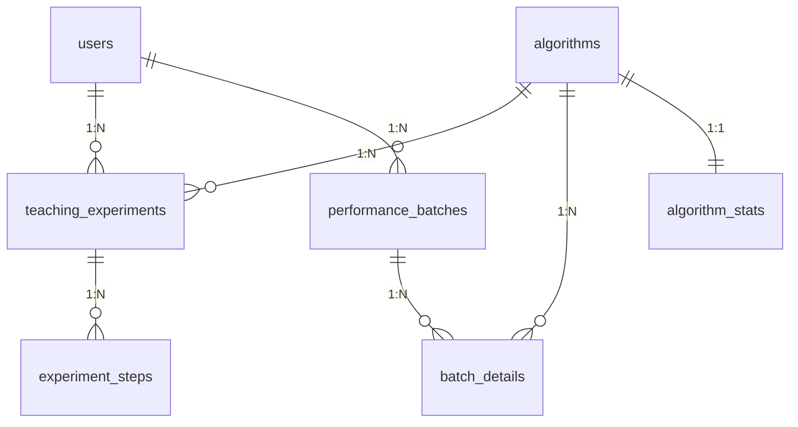

# 排序算法可视化教学与实验数据管理平台 — 数据库课程设计文档

## （2）业务信息与管理需求

### 业务背景
本系统是一个面向计算机专业教学的**排序算法可视化平台**，支持学生在线学习经典排序算法的执行过程，支持教师管理教学实验数据，支持管理员进行系统维护。

### 管理需求
1. **用户管理**：支持学生、教师、管理员三种角色注册与登录。
2. **教学实验管理**：记录每次排序实验的摘要数据和步骤快照，支持历史查询与回放。
3. **性能测试管理**：记录多算法对比测试的批次和明细，支持排名查看。
4. **统计汇总**：自动维护各算法教学与性能维度的平均值（触发器实现）。
5. **权限控制**：学生仅看自己实验，教师看全部+统计，管理员拥有全部权限含备份。

## （3）实体与联系

| 实体 | 说明 | 联系 | 类型 |
|------|------|------|:---:|
| 用户 User | 系统使用者 | 用户—教学实验 | 1:N |
| 算法 Algorithm | 排序算法元数据 | 算法—教学实验 | 1:N |
| 教学实验 TeachingExperiment | 一次教学排序 | 教学实验—实验步骤 | 1:N |
| 实验步骤 ExperimentStep | 每一步快照 | 用户—性能批次 | 1:N |
| 性能批次 PerformanceBatch | 一次性能测试 | 性能批次—批次明细 | 1:N |
| 批次明细 BatchDetail | 单个算法结果 | 算法—批次明细 | 1:N |
| 算法统计 AlgorithmStat | 触发器维护 | 算法—算法统计 | 1:1 |

## （4）实体和联系的属性

### User(`user_id` PK UUID, username UK, password_hash, role ENUM, created_at)
### Algorithm(`algo_id` PK AUTO, algo_code UK, algo_name UK, category, time_complexity, space_complexity, is_stable, pseudocode TEXT, description, advantages)
### TeachingExperiment(`exp_id` PK AUTO, user_id FK, algo_id FK, data_size, total_steps, comparisons, swaps, time_micros, interval_ms, status ENUM, started_at, finished_at)
### ExperimentStep(`step_id` PK AUTO, exp_id FK, step_number, data_json JSON, highlight_json JSON, description)
### PerformanceBatch(`batch_id` PK AUTO, user_id FK, data_size, distribution, data_type ENUM, created_at)
### BatchDetail(`detail_id` PK AUTO, batch_id FK, algo_id FK, comparisons, swaps, time_micros, rank)
### AlgorithmStat(`stat_id` PK AUTO, algo_id UK FK, total_experiments, avg_exp_comparisons, ..., total_batches, avg_batch_time_micros, updated_at)

## （5）E-R 图



## （6）关系模式

```
users(user_id, username, password_hash, role, created_at)
    PK: user_id

algorithms(algo_id, algo_code, algo_name, category, time_complexity,
           space_complexity, is_stable, pseudocode, description, advantages)
    PK: algo_id  候选码: algo_code, algo_name

teaching_experiments(exp_id, user_id, algo_id, data_size, total_steps,
                     comparisons, swaps, time_micros, interval_ms,
                     status, started_at, finished_at)
    PK: exp_id
    FK: user_id → users(user_id) ON DELETE CASCADE
    FK: algo_id → algorithms(algo_id) ON DELETE RESTRICT

experiment_steps(step_id, exp_id, step_number, data_json, highlight_json, description)
    PK: step_id
    FK: exp_id → teaching_experiments(exp_id) ON DELETE CASCADE

performance_batches(batch_id, user_id, data_size, distribution, data_type, created_at)
    PK: batch_id
    FK: user_id → users(user_id) ON DELETE CASCADE

batch_details(detail_id, batch_id, algo_id, comparisons, swaps, time_micros, rank)
    PK: detail_id
    FK: batch_id → performance_batches(batch_id) ON DELETE CASCADE
    FK: algo_id → algorithms(algo_id) ON DELETE RESTRICT

algorithm_stats(stat_id, algo_id, total_experiments, avg_exp_comparisons, ...)
    PK: stat_id  候选码: algo_id (UNIQUE)
    FK: algo_id → algorithms(algo_id) ON DELETE CASCADE
```

## （7）数据字典

详细字段定义见 `src/main/resources/db/schema.sql`，核心表7张：

| 表名 | 行数 | 主键类型 | 说明 |
|------|:---:|------|------|
| users | 3 | VARCHAR(32) UUID | 用户（学生/教师/管理员） |
| algorithms | 6 | BIGINT AUTO | 排序算法元数据 |
| teaching_experiments | ~10 | BIGINT AUTO | 教学实验摘要 |
| experiment_steps | ~300 | BIGINT AUTO | 步骤快照（保存回放时） |
| performance_batches | ~6 | BIGINT AUTO | 性能测试批次 |
| batch_details | ~6 | BIGINT AUTO | 批次明细（含排名） |
| algorithm_stats | 6 | BIGINT AUTO | 触发器自动维护的统计 |

## （8）创建数据库

```sql
CREATE DATABASE sorting_visualization DEFAULT CHARACTER SET utf8mb4;
-- 完整 DDL 见 src/main/resources/db/schema.sql（7张表+索引+外键）
-- 初始数据见 src/main/resources/db/data.sql（3用户+6算法）
```

### 数据库备份与恢复

备份文件包含全部 7 张表的完整数据，格式为标准 SQL（UTF-8 无 BOM，列名加反引号，每表前自动 TRUNCATE）。

```bash
# 恢复命令（注意 --default-character-set=utf8mb4 必不可少）
mysql -u root -p --default-character-set=utf8mb4 sorting_visualization < backups/sorting_visualization_backup_YYYYMMDD_HHMMSS.sql
```

> 也可在管理后台点击"数据库备份"→"立即备份"，通过 Web 界面生成备份文件。

## （9）查询、存储过程、触发器

### 触发器×2
- `trg_after_experiment_insert` — 教学实验 INSERT 后自动更新 algorithm_stats（教学维度滚动平均）
- `trg_after_batch_detail_insert` — 批次明细 INSERT 后自动更新 algorithm_stats（性能维度滚动平均）

### 视图×2
- `v_algorithm_ranking` — 算法综合排名（RANK() OVER 按每元素性能耗时升序，关联 algorithm_stats 计算 perf_time_per_element_us）
- `v_user_activity` — 用户活跃度汇总（教学次数+性能批次+最后活动时间）

### 存储过程×1
- `sp_user_report(IN p_user_id VARCHAR(32))` — 生成用户综合实验报告，返回 3 个结果集：
  1. **综合统计** — 教学（总实验/完成/停止/均比较/均交换/均时）+ 性能（批次/明细/均时/均比较/均交换）
  2. **最常用算法** — 按教学使用次数排名，取 TOP 1
  3. **算法明细** — 每个算法的教学和性能指标对比（含 perf_vs_teach_ratio 性价比列）

> 使用子查询分别聚合教学和性能数据，避免多表 JOIN 笛卡尔积导致统计偏差。

### 典型查询
```sql
-- 分页查用户实验
SELECT * FROM teaching_experiments WHERE user_id=? ORDER BY started_at DESC LIMIT ?,?;

-- 查步骤快照
SELECT * FROM experiment_steps WHERE exp_id=? ORDER BY step_number;

-- 查排名视图（按每元素耗时排名）
SELECT * FROM v_algorithm_ranking;

-- 查用户活跃度
SELECT * FROM v_user_activity;

-- 调用存储过程（3个结果集：综合统计 + 常用算法 + 算法明细）
CALL sp_user_report('8a5dab7a583211f1b2504c77cb9b7aa2');

-- 数据库备份（在管理后台操作，或通过 API）
-- curl -X POST http://localhost:8080/api/admin/backup
```

---

> 技术栈：Java 17 + Spring Boot 4 + MyBatis-Plus 3.5 + MySQL 8.0 + Vue 3 + Vite 5