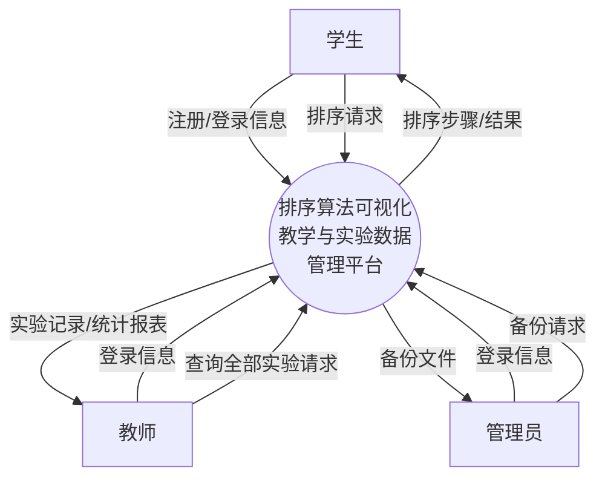
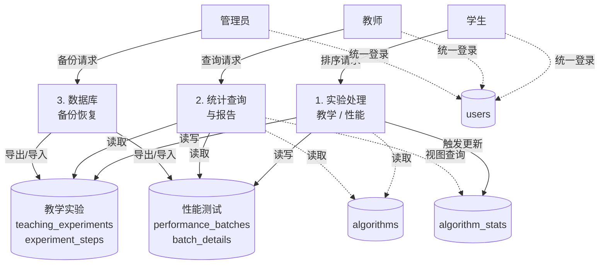
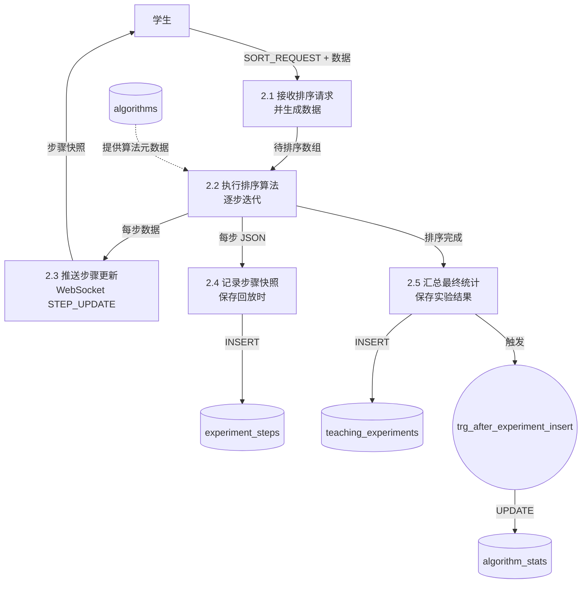
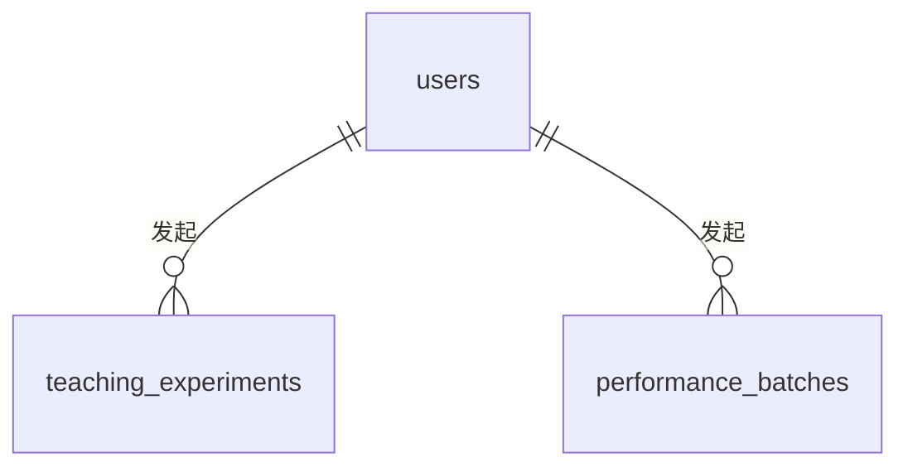
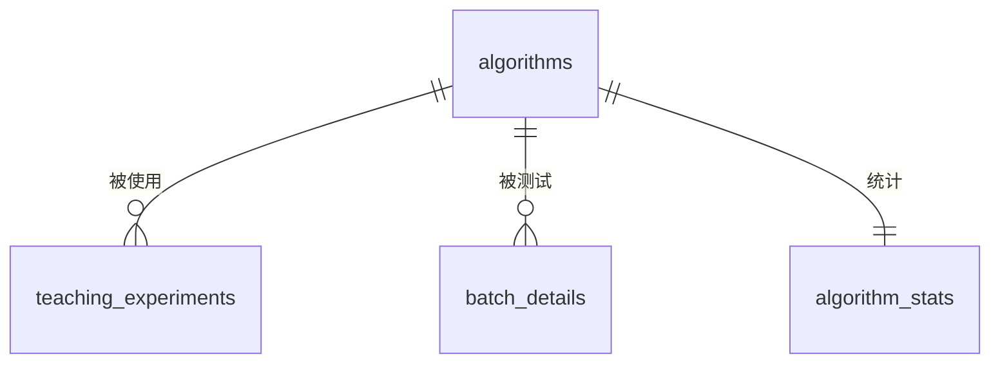
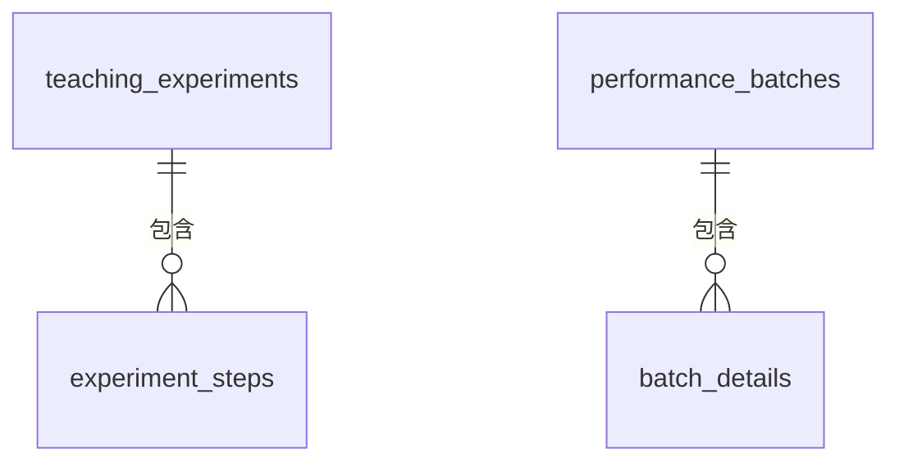
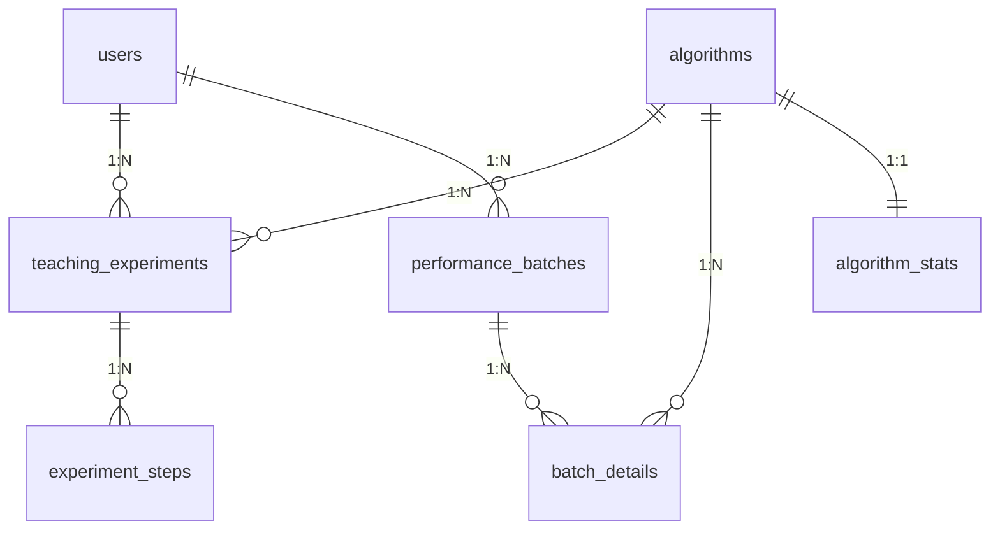

# 排序算法可视化教学与实验数据管理平台 — 数据库课程设计文档

## 1. 问题的描述（背景及意义）

在计算机专业教学中，排序算法是数据结构与算法的核心内容。传统教学方式以理论讲解和静态图示为主，学生难以直观感受算法执行过程中的数据变化和性能差异。同时，教师缺乏有效手段跟踪学生的实验记录和对比不同算法的实际运行效果。

本系统旨在构建一个**排序算法可视化教学与实验数据管理平台**，通过 WebSocket 实时推送排序步骤，以柱状图动画展示算法执行过程；并通过 MySQL 数据库持久化存储每次实验的教学数据和性能测试数据，利用触发器、视图、存储过程等数据库对象实现自动化统计，为教学管理和算法研究提供数据支撑。

## 2. 需求分析

### 2.1 需求概述

系统面向三类用户：学生（Student）、教师（Teacher）、管理员（Admin）。学生可运行排序实验、查看个人历史；教师可查看全部学生实验数据和统计报表；管理员额外拥有数据库备份权限。

### 2.2 功能需求

1. **用户管理**：支持三种角色注册与登录，角色权限分级控制。
2. **教学实验管理**：记录每次排序实验的摘要数据（算法、数据量、比较/交换次数、耗时）和步骤快照，支持历史查询与回放。
3. **性能测试管理**：记录多算法对比测试的批次和明细，支持按每元素耗时排名。
4. **统计汇总**：触发器自动维护各算法教学与性能维度的滚动平均值。
5. **数据库备份**：管理员可一键导出标准 SQL 备份文件并恢复。

### 2.3 数据流图

#### 顶层图（上下文图）

将整个系统视为一个整体，展示与外部实体的数据交互。


```mermaid
flowchart TB
    S1[学生] -->|注册/登录信息| P((排序算法可视化<br/>教学与实验数据<br/>管理平台))
    S1 -->|排序请求| P
    P -->|排序步骤/结果| S1

    S2[教师] -->|登录信息| P
    S2 -->|查询全部实验请求| P
    P -->|实验记录/统计报表| S2

    S3[管理员] -->|登录信息| P
    S3 -->|备份请求| P
    P -->|备份文件| S3
```

#### 0 层图（系统概览）


```mermaid
flowchart TB
    U1[学生] -->|排序请求| P1[1. 实验处理<br/>教学 / 性能]
    U2[教师] -->|查询请求| P2[2. 统计查询<br/>与报告]
    U3[管理员] -->|备份请求| P3[3. 数据库<br/>备份恢复]

    P1 -->|读写| DS1[(教学实验<br/>teaching_experiments<br/>experiment_steps)]
    P1 -->|读写| DS2[(性能测试<br/>performance_batches<br/>batch_details)]
    P2 -->|读取| DS1
    P2 -->|读取| DS2
    P3 -->|导出/导入| DS1
    P3 -->|导出/导入| DS2

    U1 & U2 & U3 -.->|统一登录| DB1[(users)]
    P1 & P2 -.->|读取| DB2[(algorithms)]
    P1 -->|触发更新| DB3[(algorithm_stats)]
    P2 -.->|视图查询| DB3
```

> 数据存储按业务域归并为 5 组：users、algorithms、教学实验组、性能测试组、algorithm_stats。

#### 1 层图（教学实验处理细化）

以"教学实验处理"（P2）为例，展开内部子流程。


```mermaid
flowchart TB
    U[学生] -->|SORT_REQUEST + 数据| P21[2.1 接收排序请求<br/>并生成数据]
    P21 -->|待排序数组| P22[2.2 执行排序算法<br/>逐步迭代]

    P22 -->|每步数据| P23[2.3 推送步骤更新<br/>WebSocket STEP_UPDATE]
    P23 -->|步骤快照| U

    P22 -->|每步 JSON| P24[2.4 记录步骤快照<br/>保存回放时]
    P24 -->|INSERT| D4[(experiment_steps)]

    P22 -->|排序完成| P25[2.5 汇总最终统计<br/>保存实验结果]
    P25 -->|INSERT| D3[(teaching_experiments)]

    P25 -->|触发| T1((trg_after_experiment_insert))
    T1 -->|UPDATE| D7[(algorithm_stats)]

    D2[(algorithms)] -.->|提供算法元数据| P22
```

> 性能测试处理（P3）的 1 层图结构类似：接收测试请求 → 依次执行 6 种算法 → 推送每算法结果 → 保存批次+明细 → 触发器更新统计。

### 2.4 数据字典

#### 2.4.1 users — 用户表

| 数据项名      | 数据项含义                  | 别名     | 数据类型                          | 数值范围                                |
| ------------- | --------------------------- | -------- | --------------------------------- | --------------------------------------- |
| user_id       | 唯一标识每个用户            | 用户编号 | VARCHAR(32)                       | NOT NULL, PRIMARY KEY, UUID 32 位无横线 |
| username      | 用户登录名                  | 用户名   | VARCHAR(50)                       | NOT NULL, UNIQUE                        |
| password_hash | 用户登录密码（BCrypt 加密） | 密码     | VARCHAR(255)                      | NOT NULL                                |
| role          | 用户角色                    | 角色     | ENUM('student','teacher','admin') | NOT NULL, DEFAULT 'student'             |
| email         | 用户邮箱                    | 邮箱     | VARCHAR(100)                      | NULL                                    |
| created_at    | 账号创建时间                | 注册时间 | TIMESTAMP                         | DEFAULT CURRENT_TIMESTAMP               |

#### 2.4.2 algorithms — 算法元数据表

| 数据项名         | 数据项含义             | 别名       | 数据类型     | 数值范围                                       |
| ---------------- | ---------------------- | ---------- | ------------ | ---------------------------------------------- |
| algo_id          | 唯一标识每个算法       | 算法编号   | BIGINT       | NOT NULL, PRIMARY KEY, AUTO_INCREMENT          |
| algo_code        | 算法内部代码           | 算法代码   | VARCHAR(20)  | NOT NULL, UNIQUE（如 BUBBLE/QUICK/INSERTION）  |
| algo_name        | 算法中文名称           | 算法名称   | VARCHAR(50)  | NOT NULL, UNIQUE                               |
| category         | 算法分类               | 类别       | VARCHAR(20)  | NOT NULL（exchange/insertion/selection/merge） |
| time_complexity  | 时间复杂度             | 时间复杂度 | VARCHAR(50)  | NULL                                           |
| space_complexity | 空间复杂度             | 空间复杂度 | VARCHAR(20)  | NULL                                           |
| is_stable        | 是否为稳定排序         | 稳定性     | BOOLEAN      | NULL（TRUE/FALSE）                             |
| pseudocode       | 算法伪代码（多行文本） | 伪代码     | TEXT         | NULL                                           |
| description      | 算法简要说明           | 简介       | VARCHAR(500) | NULL                                           |
| advantages       | 算法优点描述           | 优点       | VARCHAR(500) | NULL                                           |

#### 2.4.3 teaching_experiments — 教学实验记录表

| 数据项名    | 数据项含义           | 别名     | 数据类型                            | 数值范围                                            |
| ----------- | -------------------- | -------- | ----------------------------------- | --------------------------------------------------- |
| exp_id      | 唯一标识每次教学实验 | 实验编号 | BIGINT                              | NOT NULL, PRIMARY KEY, AUTO_INCREMENT               |
| user_id     | 执行实验的用户       | 用户编号 | VARCHAR(32)                         | NOT NULL, FK→users(user_id) ON DELETE CASCADE       |
| algo_id     | 使用的排序算法       | 算法编号 | BIGINT                              | NOT NULL, FK→algorithms(algo_id) ON DELETE RESTRICT |
| data_size   | 排序数据规模         | 数据量   | INT                                 | NOT NULL                                            |
| total_steps | 排序总步数           | 总步数   | INT                                 | DEFAULT 0                                           |
| comparisons | 总比较次数           | 比较次数 | INT                                 | DEFAULT 0                                           |
| swaps       | 总交换次数           | 交换次数 | INT                                 | DEFAULT 0                                           |
| time_micros | 总耗时（微秒）       | 耗时     | BIGINT                              | DEFAULT 0                                           |
| interval_ms | 步进间隔（毫秒）     | 步进间隔 | INT                                 | DEFAULT 1000                                        |
| status      | 实验状态             | 状态     | ENUM('COMPLETED','STOPPED','ERROR') | DEFAULT 'COMPLETED'                                 |
| started_at  | 实验开始时间         | 开始时间 | TIMESTAMP                           | DEFAULT CURRENT_TIMESTAMP                           |
| finished_at | 实验结束时间         | 结束时间 | TIMESTAMP                           | NULL                                                |

#### 2.4.4 experiment_steps — 实验步骤快照表

| 数据项名       | 数据项含义                 | 别名     | 数据类型     | 数值范围                                                    |
| -------------- | -------------------------- | -------- | ------------ | ----------------------------------------------------------- |
| step_id        | 唯一标识每个步骤           | 步骤编号 | BIGINT       | NOT NULL, PRIMARY KEY, AUTO_INCREMENT                       |
| exp_id         | 所属教学实验               | 实验编号 | BIGINT       | NOT NULL, FK→teaching_experiments(exp_id) ON DELETE CASCADE |
| step_number    | 步骤序号                   | 步骤序号 | INT          | NOT NULL                                                    |
| data_json      | 当前步骤的数组快照（JSON） | 数据快照 | JSON         | NOT NULL                                                    |
| highlight_json | 当前步骤的高亮信息（JSON） | 高亮信息 | JSON         | NULL                                                        |
| description    | 步骤文字描述               | 步骤描述 | VARCHAR(200) | NULL                                                        |

#### 2.4.5 performance_batches — 性能测试批次表

| 数据项名     | 数据项含义           | 别名     | 数据类型                          | 数值范围                                      |
| ------------ | -------------------- | -------- | --------------------------------- | --------------------------------------------- |
| batch_id     | 唯一标识每个性能批次 | 批次编号 | BIGINT                            | NOT NULL, PRIMARY KEY, AUTO_INCREMENT         |
| user_id      | 执行测试的用户       | 用户编号 | VARCHAR(32)                       | NOT NULL, FK→users(user_id) ON DELETE CASCADE |
| data_size    | 测试数据规模         | 数据量   | INT                               | NOT NULL                                      |
| distribution | 数据分布方式         | 分布     | VARCHAR(30)                       | NULL（RANDOM/SORTED/REVERSE/DUPLICATE）       |
| data_type    | 数据类型             | 数据类型 | ENUM('INTEGER','DOUBLE','PERSON') | DEFAULT 'INTEGER'                             |
| created_at   | 测试执行时间         | 创建时间 | TIMESTAMP                         | DEFAULT CURRENT_TIMESTAMP                     |

#### 2.4.6 batch_details — 批次明细表

| 数据项名    | 数据项含义               | 别名     | 数据类型 | 数值范围                                                     |
| ----------- | ------------------------ | -------- | -------- | ------------------------------------------------------------ |
| detail_id   | 唯一标识每条明细         | 明细编号 | BIGINT   | NOT NULL, PRIMARY KEY, AUTO_INCREMENT                        |
| batch_id    | 所属性能批次             | 批次编号 | BIGINT   | NOT NULL, FK→performance_batches(batch_id) ON DELETE CASCADE |
| algo_id     | 被测试的算法             | 算法编号 | BIGINT   | NOT NULL, FK→algorithms(algo_id) ON DELETE RESTRICT          |
| comparisons | 该算法比较次数           | 比较次数 | INT      | DEFAULT 0                                                    |
| swaps       | 该算法交换次数           | 交换次数 | INT      | DEFAULT 0                                                    |
| time_micros | 该算法耗时（微秒）       | 耗时     | BIGINT   | DEFAULT 0                                                    |
| rank        | 批次内排名（按耗时升序） | 排名     | INT      | NULL                                                         |

#### 2.4.7 algorithm_stats — 算法统计表（触发器维护）

| 数据项名              | 数据项含义           | 别名       | 数据类型      | 数值范围                                                   |
| --------------------- | -------------------- | ---------- | ------------- | ---------------------------------------------------------- |
| stat_id               | 唯一标识每条统计     | 统计编号   | BIGINT        | NOT NULL, PRIMARY KEY, AUTO_INCREMENT                      |
| algo_id               | 被统计的算法         | 算法编号   | BIGINT        | NOT NULL, UNIQUE, FK→algorithms(algo_id) ON DELETE CASCADE |
| total_experiments     | 教学实验总次数       | 教学次数   | INT           | DEFAULT 0                                                  |
| avg_exp_comparisons   | 教学实验平均比较次数 | 教学均比较 | DECIMAL(12,2) | DEFAULT 0                                                  |
| avg_exp_swaps         | 教学实验平均交换次数 | 教学均交换 | DECIMAL(12,2) | DEFAULT 0                                                  |
| avg_exp_time_micros   | 教学实验平均耗时     | 教学均时   | DECIMAL(12,2) | DEFAULT 0                                                  |
| total_batches         | 性能测试总次数       | 性能次数   | INT           | DEFAULT 0                                                  |
| avg_batch_comparisons | 性能测试平均比较次数 | 性能均比较 | DECIMAL(12,2) | DEFAULT 0                                                  |
| avg_batch_swaps       | 性能测试平均交换次数 | 性能均交换 | DECIMAL(12,2) | DEFAULT 0                                                  |
| avg_batch_time_micros | 性能测试平均耗时     | 性能均时   | DECIMAL(12,2) | DEFAULT 0                                                  |
| updated_at            | 最后更新时间         | 更新时间   | TIMESTAMP     | DEFAULT CURRENT_TIMESTAMP ON UPDATE                        |

## 3. 概念结构设计

### 3.1 实体

从需求分析中抽象出以下 7 个实体：

| 实体 | 属性 | 对应表 |
|------|------|--------|
| 用户（User） | user_id, username, password_hash, role, email, created_at | users |
| 算法（Algorithm） | algo_id, algo_code, algo_name, category, time_complexity, space_complexity, is_stable, pseudocode, description, advantages | algorithms |
| 教学实验（TeachingExperiment） | exp_id, user_id, algo_id, data_size, total_steps, comparisons, swaps, time_micros, interval_ms, status, started_at, finished_at | teaching_experiments |
| 实验步骤（ExperimentStep） | step_id, exp_id, step_number, data_json, highlight_json, description | experiment_steps |
| 性能批次（PerformanceBatch） | batch_id, user_id, data_size, distribution, data_type, created_at | performance_batches |
| 批次明细（BatchDetail） | detail_id, batch_id, algo_id, comparisons, swaps, time_micros, rank | batch_details |
| 算法统计（AlgorithmStat） | stat_id, algo_id, total_experiments, avg_exp_comparisons, avg_exp_swaps, avg_exp_time_micros, total_batches, avg_batch_comparisons, avg_batch_swaps, avg_batch_time_micros, updated_at | algorithm_stats |

### 3.2 实体间的联系

| 联系             | 参与实体            | 类型 | 说明                         |
| ---------------- | ------------------- | :--: | ---------------------------- |
| 发起教学实验     | 用户 → 教学实验     | 1:N  | 一个用户可执行多次教学实验   |
| 发起性能测试     | 用户 → 性能批次     | 1:N  | 一个用户可执行多次性能测试   |
| 使用算法（教学） | 算法 → 教学实验     | 1:N  | 一个算法被多次教学实验使用   |
| 使用算法（性能） | 算法 → 批次明细     | 1:N  | 一个算法被多次性能测试使用   |
| 统计汇总         | 算法 → 算法统计     | 1:1  | 每个算法对应一条统计记录     |
| 包含步骤         | 教学实验 → 实验步骤 | 1:N  | 一个教学实验包含多个步骤快照 |
| 包含明细         | 性能批次 → 批次明细 | 1:N  | 一个性能批次包含多个算法结果 |

### 3.3 局部 E-R 图

**用户-实验子图**


```mermaid
erDiagram
    users ||--o{ teaching_experiments : "发起"
    users ||--o{ performance_batches : "发起"
```

**算法-结果子图**


```mermaid
erDiagram
    algorithms ||--o{ teaching_experiments : "被使用"
    algorithms ||--o{ batch_details : "被测试"
    algorithms ||--|| algorithm_stats : "统计"
```

**实验-步骤子图**


```mermaid
erDiagram
    teaching_experiments ||--o{ experiment_steps : "包含"
    performance_batches ||--o{ batch_details : "包含"
```

### 3.4 全局 E-R 图


```mermaid
erDiagram
    users ||--o{ teaching_experiments : "1:N"
    users ||--o{ performance_batches : "1:N"
    algorithms ||--o{ teaching_experiments : "1:N"
    algorithms ||--o{ batch_details : "1:N"
    algorithms ||--|| algorithm_stats : "1:1"
    teaching_experiments ||--o{ experiment_steps : "1:N"
    performance_batches ||--o{ batch_details : "1:N"
```

## 4. 逻辑结构设计

### 4.1 由系统 E-R 图转化而得到的关系模式

```
users(user_id, username, password_hash, role, email, created_at)
    PK: user_id (VARCHAR(32) UUID)
    候选码: username (UNIQUE)

algorithms(algo_id, algo_code, algo_name, category, time_complexity,
           space_complexity, is_stable, pseudocode, description, advantages)
    PK: algo_id (BIGINT AUTO_INCREMENT)
    候选码: algo_code, algo_name (均为 UNIQUE)

teaching_experiments(exp_id, user_id, algo_id, data_size, total_steps,
                     comparisons, swaps, time_micros, interval_ms,
                     status, started_at, finished_at)
    PK: exp_id (BIGINT AUTO_INCREMENT)
    FK: user_id → users(user_id) ON DELETE CASCADE
    FK: algo_id → algorithms(algo_id) ON DELETE RESTRICT

experiment_steps(step_id, exp_id, step_number, data_json, highlight_json, description)
    PK: step_id (BIGINT AUTO_INCREMENT)
    FK: exp_id → teaching_experiments(exp_id) ON DELETE CASCADE

performance_batches(batch_id, user_id, data_size, distribution, data_type, created_at)
    PK: batch_id (BIGINT AUTO_INCREMENT)
    FK: user_id → users(user_id) ON DELETE CASCADE

batch_details(detail_id, batch_id, algo_id, comparisons, swaps, time_micros, `rank`)
    PK: detail_id (BIGINT AUTO_INCREMENT)
    FK: batch_id → performance_batches(batch_id) ON DELETE CASCADE
    FK: algo_id → algorithms(algo_id) ON DELETE RESTRICT

algorithm_stats(stat_id, algo_id, total_experiments, avg_exp_comparisons,
                avg_exp_swaps, avg_exp_time_micros, total_batches,
                avg_batch_comparisons, avg_batch_swaps, avg_batch_time_micros, updated_at)
    PK: stat_id (BIGINT AUTO_INCREMENT)
    候选码: algo_id (UNIQUE)
    FK: algo_id → algorithms(algo_id) ON DELETE CASCADE
```

### 4.2 外模式（视图）

| 视图名称              | 用途                         | 数据来源                                                           |
| --------------------- | ---------------------------- | ------------------------------------------------------------------ |
| `v_algorithm_ranking` | 算法综合排名（按每元素耗时） | algorithms + algorithm_stats + performance_batches + batch_details |
| `v_user_activity`     | 用户活跃度汇总               | users + teaching_experiments + performance_batches                 |

## 5. 物理结构设计

### 5.1 描述

- **存储引擎**：InnoDB（支持事务和外键约束）
- **字符集**：utf8mb4（完整支持中文和 Emoji）
- **排序规则**：utf8mb4_0900_ai_ci
- **主键策略**：users 表使用 VARCHAR(32) + MyBatis-Plus ASSIGN_UUID，其余表使用 BIGINT AUTO_INCREMENT
- **JSON 字段**：experiment_steps 的 data_json 和 highlight_json 使用 MySQL JSON 类型，支持 JSON 函数查询

### 5.2 索引

| 表名                 | 索引名              | 类型   | 字段                  | 说明               |
| -------------------- | ------------------- | ------ | --------------------- | ------------------ |
| users                | PRIMARY             | 主键   | user_id               | 聚簇索引           |
| users                | username            | UNIQUE | username              | 登录唯一性         |
| algorithms           | PRIMARY             | 主键   | algo_id               | 聚簇索引           |
| algorithms           | uk_algo_code        | UNIQUE | algo_code             | 算法代码唯一       |
| algorithms           | uk_algo_name        | UNIQUE | algo_name             | 算法名称唯一       |
| teaching_experiments | PRIMARY             | 主键   | exp_id                | 聚簇索引           |
| teaching_experiments | idx_exp_user_time   | 普通   | (user_id, started_at) | 用户实验按时间查询 |
| teaching_experiments | idx_exp_algo_status | 普通   | (algo_id, status)     | 按算法和状态统计   |
| experiment_steps     | PRIMARY             | 主键   | step_id               | 聚簇索引           |
| experiment_steps     | idx_step_exp        | 普通   | (exp_id, step_number) | 步骤按序查询       |
| performance_batches  | PRIMARY             | 主键   | batch_id              | 聚簇索引           |
| performance_batches  | idx_batch_user      | 普通   | (user_id, created_at) | 用户批次按时间查询 |
| batch_details        | PRIMARY             | 主键   | detail_id             | 聚簇索引           |
| batch_details        | idx_detail_batch    | 普通   | batch_id              | 批次明细查询       |
| algorithm_stats      | PRIMARY             | 主键   | stat_id               | 聚簇索引           |
| algorithm_stats      | algo_id             | UNIQUE | algo_id               | 算法一对一统计     |

## 6. 数据库实现

### 6.1 表

共 7 张核心表，完整 DDL 见 `src/main/resources/db/schema.sql`：

| 表名                 | 行数 | 说明                                 |
| -------------------- | :--: | ------------------------------------ |
| users                |  3   | 预设 admin/teacher/student 账号      |
| algorithms           |  6   | 冒泡、快速、直接插入、希尔、堆、归并 |
| teaching_experiments | ~10  | 教学实验摘要                         |
| experiment_steps     | ~300 | 步骤快照（JSON 存储每步数组和高亮）  |
| performance_batches  |  ~6  | 性能测试批次                         |
| batch_details        |  ~6  | 各算法性能明细（含排名）             |
| algorithm_stats      |  6   | 触发器自动维护                       |

创库语句：

```sql
CREATE DATABASE sorting_visualization DEFAULT CHARACTER SET utf8mb4;
```

初始化：

```bash
mysql -u root -p sorting_visualization < src/main/resources/db/schema.sql
mysql -u root -p sorting_visualization < src/main/resources/db/data.sql
mysql -u root -p sorting_visualization < src/main/resources/db/procedures.sql
```

> 应用首次启动时 `DatabaseInitializer` 会自动执行 procedures.sql，创建触发器、视图和存储过程。

### 6.2 视图

**v_algorithm_ranking** — 算法综合排名

```sql
CREATE VIEW v_algorithm_ranking AS
SELECT
    a.algo_name, a.category, a.time_complexity, a.is_stable,
    COALESCE(s.total_experiments, 0) AS teaching_count,
    COALESCE(s.total_batches, 0)    AS perf_count,
    COALESCE(s.avg_exp_time_micros, 0)   AS teach_avg_time_us,
    COALESCE(s.avg_batch_time_micros, 0) AS perf_avg_time_us,
    COALESCE(ds.avg_data_size, 0)   AS perf_avg_data_size,
    ROUND(s.avg_batch_time_micros / ds.avg_data_size, 2) AS perf_time_per_element_us,
    RANK() OVER (ORDER BY s.avg_batch_time_micros / ds.avg_data_size) AS speed_rank
FROM algorithms a
LEFT JOIN algorithm_stats s ON a.algo_id = s.algo_id
LEFT JOIN (
    SELECT bd.algo_id, ROUND(AVG(pb.data_size), 0) AS avg_data_size
    FROM batch_details bd
    JOIN performance_batches pb ON bd.batch_id = pb.batch_id
    GROUP BY bd.algo_id
) ds ON a.algo_id = ds.algo_id;
```

**v_user_activity** — 用户活跃度

```sql
CREATE VIEW v_user_activity AS
SELECT u.user_id, u.username, u.role,
    COALESCE(te.exp_count, 0)  AS teaching_experiments,
    COALESCE(pb.batch_count, 0) AS performance_batches,
    GREATEST(COALESCE(te.last_exp, '1970-01-01'),
             COALESCE(pb.last_batch, '1970-01-01')) AS last_activity
FROM users u
LEFT JOIN (
    SELECT user_id, COUNT(*) AS exp_count, MAX(started_at) AS last_exp
    FROM teaching_experiments GROUP BY user_id
) te ON u.user_id = te.user_id
LEFT JOIN (
    SELECT user_id, COUNT(*) AS batch_count, MAX(created_at) AS last_batch
    FROM performance_batches GROUP BY user_id
) pb ON u.user_id = pb.user_id;
```

### 6.3 触发器设计

| 触发器                          | 触发时机                          | 功能                                        |
| ------------------------------- | --------------------------------- | ------------------------------------------- |
| `trg_after_experiment_insert`   | teaching_experiments 表 INSERT 后 | 自动更新 algorithm_stats 教学维度滚动平均值 |
| `trg_after_batch_detail_insert` | batch_details 表 INSERT 后        | 自动更新 algorithm_stats 性能维度滚动平均值 |

两触发器均使用 `INSERT ... ON DUPLICATE KEY UPDATE` 实现增量滚动平均：

```
新平均值 = (旧平均值 × (总数-1) + 新值) / 总数
```

### 6.4 存储过程设计

**sp_user_report(IN p_user_id VARCHAR(32))** — 用户综合实验报告

返回 3 个结果集：

1. **综合统计**：教学维度（总实验/完成/停止/均比较/均交换/均时）+ 性能维度（批次/明细/均时）
2. **最常用算法**：按教学使用次数排名 TOP 1
3. **算法明细**：每个算法的教学与性能指标对比，含 `perf_vs_teach_ratio` 比值

> 使用子查询分别聚合教学和性能数据，避免多表 JOIN 产生笛卡尔积导致统计数据偏差。

## 7. 系统运行情况及用户界面

### 7.1 主页—可视化

系统主页提供教学模式和性能模式切换。教学模式支持实时 WebSocket 推送排序步骤并以 SVG 柱状图渲染；性能模式使用 Chart.js 展示 6 种算法的耗时柱状图对比。

### 7.2 实验历史

分"教学记录"和"性能记录"两个 Tab。教学记录支持分页查看、详情弹窗（含步骤快照列表）和回放功能；性能记录显示批次排名详情。教师可勾选"查看全部用户实验"切换全局视图。

### 7.3 管理后台

4 个 Tab 页：

- **算法统计**：合并展示教学/性能双维度指标 + 每元素耗时 + 速度排名
- **用户活跃**：基于 v_user_activity 视图的用户活跃度汇总表
- **用户报告**：输入用户 UUID，调用 sp_user_report 生成含算法明细对比的综合报告
- **数据库备份**（仅管理员）：一键导出标准 SQL 备份文件

### 7.4 预设账号

| 用户名  | 密码       | 角色   |
| ------- | ---------- | ------ |
| admin   | admin123   | 管理员 |
| teacher | teacher123 | 教师   |
| student | student123 | 学生   |

## 8. 总结

本项目完整实现了数据库课程设计的全部环节：从需求分析、概念结构设计（E-R 图）、逻辑结构设计（关系模式+范式分析）、物理结构设计（索引+存储引擎），到最终的数据库实现（DDL + 触发器 + 视图 + 存储过程）。

核心特点：

- **7 张表**涵盖用户、算法、教学实验、步骤快照、性能批次、批次明细和统计汇总
- **2 个触发器**实现算法统计的自动化滚动平均维护
- **2 个视图**提供排名和活跃度查询接口
- **1 个存储过程**生成用户综合实验报告（3 个结果集）
- **完整的外键约束**保证数据参照完整性
- **基于 UUID 的用户主键**和 **AUTO_INCREMENT 的业务主键**混合策略

系统采用 Java 17 + Spring Boot 4 + MyBatis-Plus 3.5 + MySQL 8.0 + Vue 3 + Vite 5 技术栈，前后端分离，WebSocket 实时通信，已具备完整可用的数据库管理和实验数据记录能力。

---

> 完整源代码：https://github.com/zhanzhan702/SortingAlgorithmVisualizationSystem
