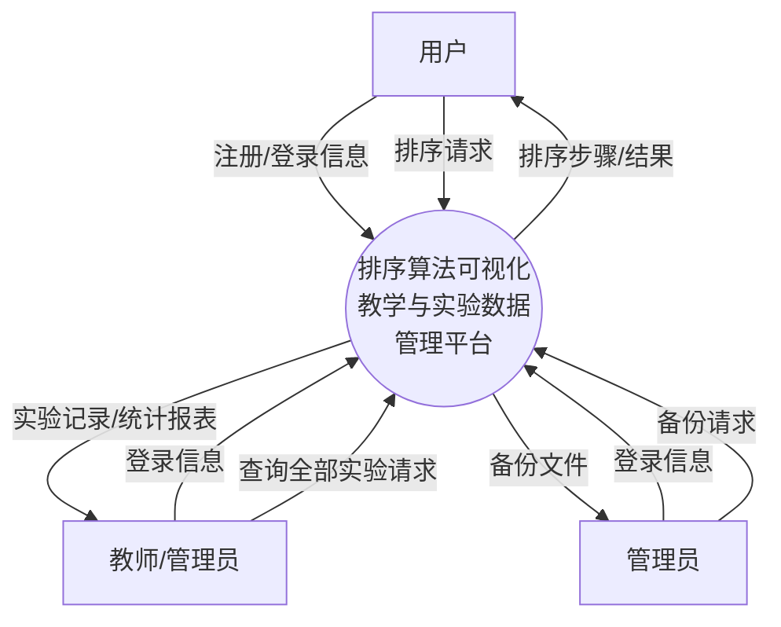
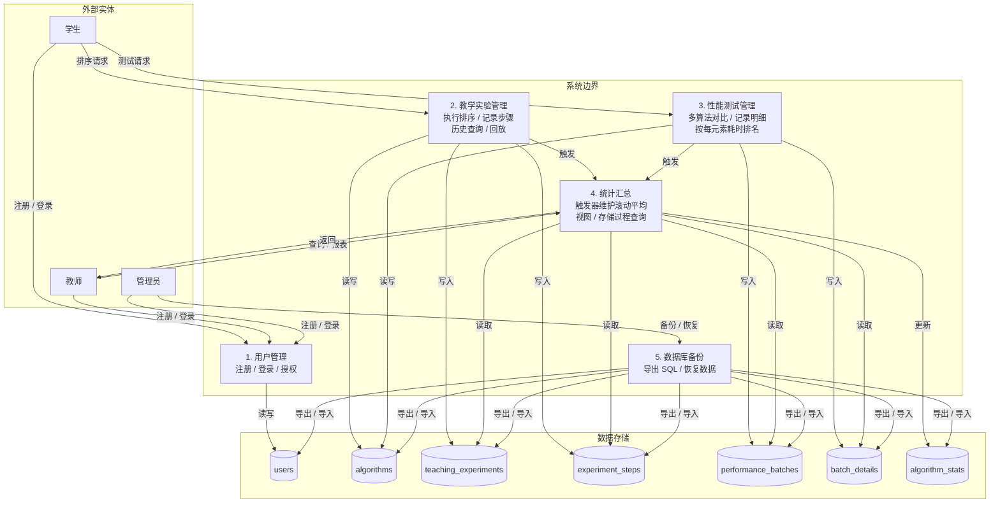
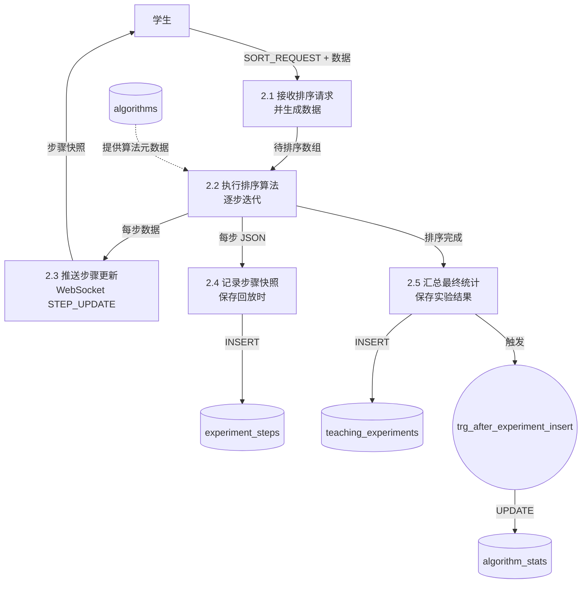
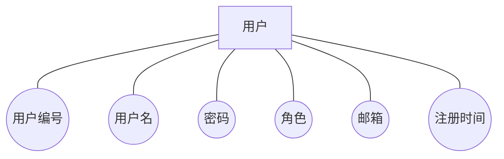
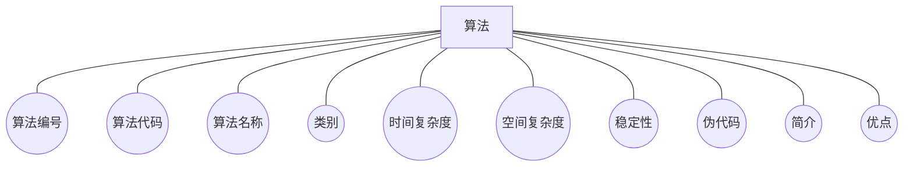
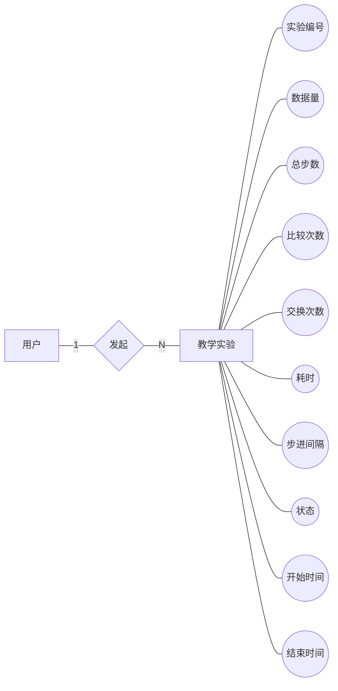
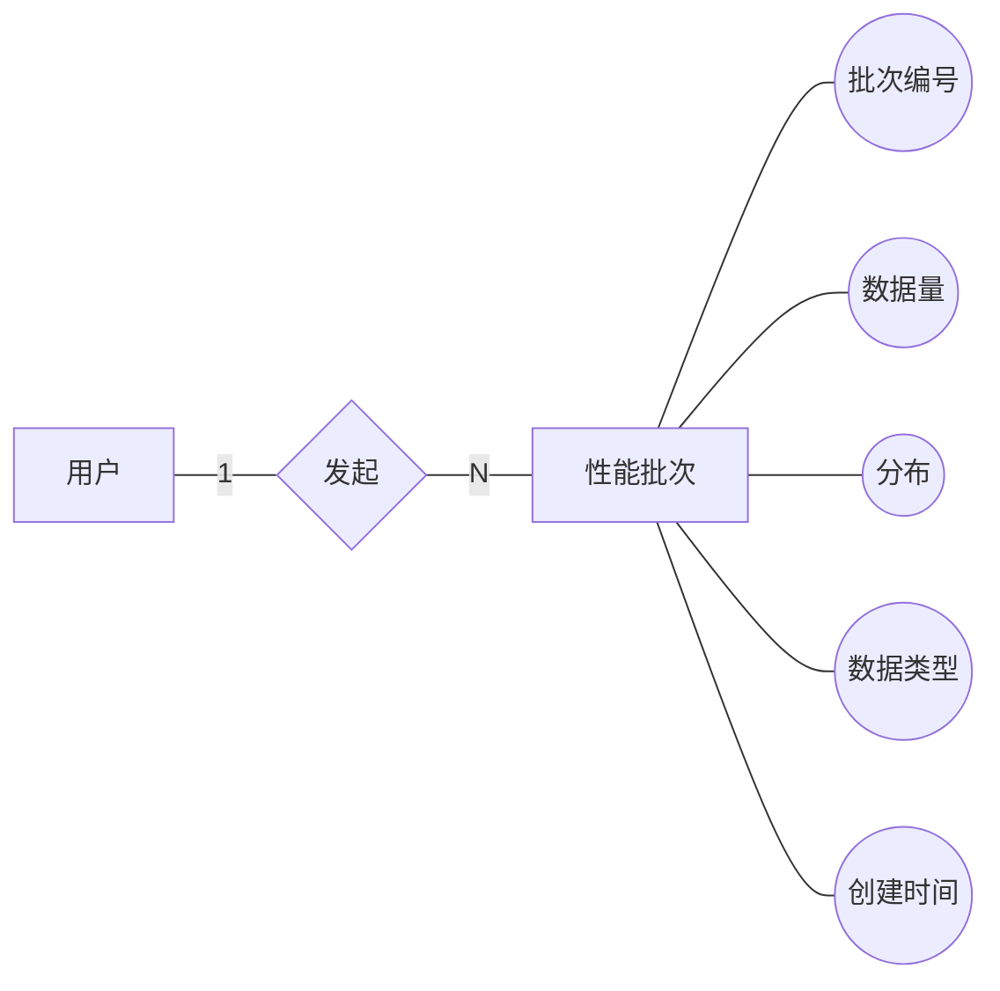
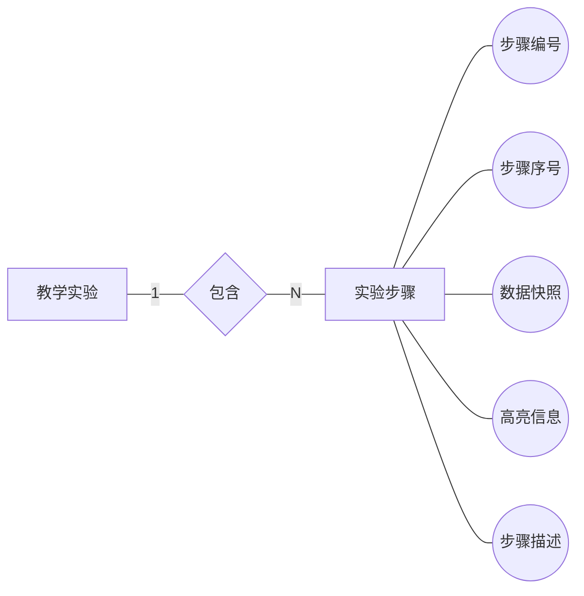
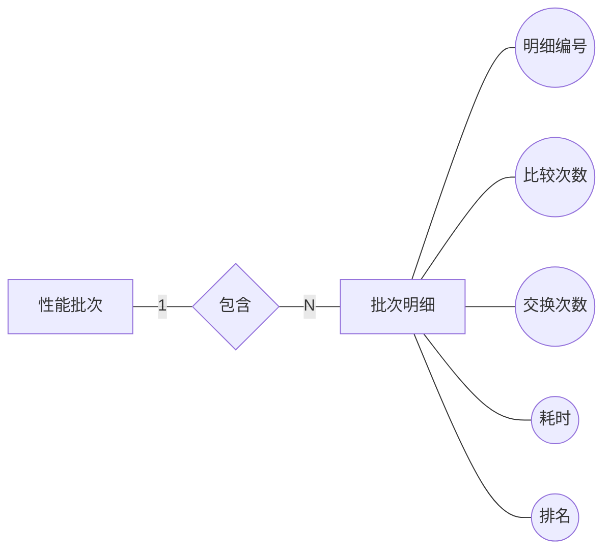
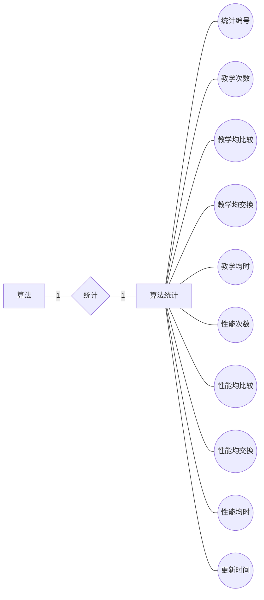

# 排序算法可视化教学与实验数据管理平台 — 数据库课程设计文档

## 1. 问题的描述（背景及意义）

在计算机专业教学中，排序算法是数据结构与算法的核心内容。传统教学方式以理论讲解和静态图示为主，学生难以直观感受算法执行过程中的数据变化和性能差异。同时，教师缺乏有效手段跟踪学生的实验记录和对比不同算法的实际运行效果。

本系统旨在构建一个**排序算法可视化教学与实验数据管理平台**，通过 WebSocket 实时推送排序步骤，以柱状图动画展示算法执行过程；并通过 MySQL 数据库持久化存储每次实验的教学数据和性能测试数据，利用触发器、视图、存储过程等数据库对象实现自动化统计，为教学管理和算法研究提供数据支撑。

## 2. 需求分析

### 2.1 需求概述

系统面向三类用户：学生（Student）、教师（Teacher）、管理员（Admin）。学生可运行排序实验、查看个人历史；教师可查看全部学生实验数据和统计报表；管理员额外拥有数据库备份权限。

### 2.2 功能需求

1. **用户管理**：支持三种角色注册与登录，角色权限分级控制。
2. **教学实验管理**：记录每次排序实验的摘要数据（算法、数据量、比较/交换次数、耗时）和步骤快照，支持历史查询与回放。
3. **性能测试管理**：记录多算法对比测试的批次和明细，支持按每元素耗时排名。
4. **统计汇总**：触发器自动维护各算法教学与性能维度的滚动平均值。
5. **数据库备份**：管理员可一键导出标准 SQL 备份文件并恢复。

### 2.3 数据流图

#### 顶层图（上下文图）

将整个系统视为一个整体，展示与外部实体的数据交互。


```mermaid
flowchart TB
    S1[用户] -->|注册/登录信息| P((排序算法可视化<br/>教学与实验数据<br/>管理平台))
    S1 -->|排序请求| P
    P -->|排序步骤/结果| S1

    S2[教师/管理员] -->|登录信息| P
    S2 -->|查询全部实验请求| P
    P -->|实验记录/统计报表| S2

    S3[管理员] -->|登录信息| P
    S3 -->|备份请求| P
    P -->|备份文件| S3
```

#### 0 层图（系统概览）


```mermaid
flowchart TB
    subgraph 外部实体
        U1[学生]
        U2[教师]
        U3[管理员]
    end

    subgraph 系统边界
        P1[1. 用户管理<br/>注册 / 登录 / 授权]
        P2[2. 教学实验管理<br/>执行排序 / 记录步骤<br/>历史查询 / 回放]
        P3[3. 性能测试管理<br/>多算法对比 / 记录明细<br/>按每元素耗时排名]
        P4[4. 统计汇总<br/>触发器维护滚动平均<br/>视图 / 存储过程查询]
        P5[5. 数据库备份<br/>导出 SQL / 恢复数据]
    end

    subgraph 数据存储
        D1[(users)]
        D2[(algorithms)]
        D3[(teaching_experiments)]
        D4[(experiment_steps)]
        D5[(performance_batches)]
        D6[(batch_details)]
        D7[(algorithm_stats)]
    end

    U1 & U2 & U3 -->|注册 / 登录| P1
    P1 -->|读写| D1

    U1 -->|排序请求| P2
    P2 -->|读写| D2
    P2 -->|写入| D3
    P2 -->|写入| D4
    P2 -->|触发| P4

    U1 -->|测试请求| P3
    P3 -->|读写| D2
    P3 -->|写入| D5
    P3 -->|写入| D6
    P3 -->|触发| P4

    U2 -->|查询 / 报表| P4
    P4 -->|读取| D3
    P4 -->|读取| D4
    P4 -->|读取| D5
    P4 -->|读取| D6
    P4 -->|更新| D7
    P4 -->|返回| U2

    U3 -->|备份 / 恢复| P5
    P5 -->|导出 / 导入| D1
    P5 -->|导出 / 导入| D2
    P5 -->|导出 / 导入| D3
    P5 -->|导出 / 导入| D4
    P5 -->|导出 / 导入| D5
    P5 -->|导出 / 导入| D6
    P5 -->|导出 / 导入| D7
```

#### 1 层图（教学实验处理细化）

以"教学实验管理"（P2）为例，展开内部子流程。


```mermaid
flowchart TB
    U[学生] -->|SORT_REQUEST + 数据| P21[2.1 接收排序请求<br/>并生成数据]
    P21 -->|待排序数组| P22[2.2 执行排序算法<br/>逐步迭代]

    P22 -->|每步数据| P23[2.3 推送步骤更新<br/>WebSocket STEP_UPDATE]
    P23 -->|步骤快照| U

    P22 -->|每步 JSON| P24[2.4 记录步骤快照<br/>保存回放时]
    P24 -->|INSERT| D4[(experiment_steps)]

    P22 -->|排序完成| P25[2.5 汇总最终统计<br/>保存实验结果]
    P25 -->|INSERT| D3[(teaching_experiments)]

    P25 -->|触发| T1((trg_after_experiment_insert))
    T1 -->|UPDATE| D7[(algorithm_stats)]

    D2[(algorithms)] -.->|提供算法元数据| P22
```

> 性能测试处理（P3）的 1 层图结构类似：接收测试请求 → 依次执行 6 种算法 → 推送每算法结果 → 保存批次+明细 → 触发器更新统计。

### 2.4 数据字典

#### 2.4.1 users — 用户表

| 数据项名      | 数据项含义               | 别名     | 数据类型                          | 数值范围                                |
| ------------- | ------------------------ | -------- | --------------------------------- | --------------------------------------- |
| user_id       | 唯一标识每个用户         | 用户编号 | VARCHAR(32)                       | NOT NULL, PRIMARY KEY, UUID 32 位无横线 |
| username      | 用户登录名               | 用户名   | VARCHAR(50)                       | NOT NULL, UNIQUE                        |
| password_hash | 用户登录密码（明文存储） | 密码     | VARCHAR(255)                      | NOT NULL                                |
| role          | 用户角色                 | 角色     | ENUM('student','teacher','admin') | NOT NULL, DEFAULT 'student'             |
| email         | 用户邮箱                 | 邮箱     | VARCHAR(100)                      | NULL                                    |
| created_at    | 账号创建时间             | 注册时间 | TIMESTAMP                         | DEFAULT CURRENT_TIMESTAMP               |

#### 2.4.2 algorithms — 算法元数据表

| 数据项名         | 数据项含义             | 别名       | 数据类型     | 数值范围                                       |
| ---------------- | ---------------------- | ---------- | ------------ | ---------------------------------------------- |
| algo_id          | 唯一标识每个算法       | 算法编号   | BIGINT       | NOT NULL, PRIMARY KEY, AUTO_INCREMENT          |
| algo_code        | 算法内部代码           | 算法代码   | VARCHAR(20)  | NOT NULL, UNIQUE（如 BUBBLE/QUICK/INSERTION）  |
| algo_name        | 算法中文名称           | 算法名称   | VARCHAR(50)  | NOT NULL, UNIQUE                               |
| category         | 算法分类               | 类别       | VARCHAR(20)  | NOT NULL（exchange/insertion/selection/merge） |
| time_complexity  | 时间复杂度             | 时间复杂度 | VARCHAR(50)  | NULL                                           |
| space_complexity | 空间复杂度             | 空间复杂度 | VARCHAR(20)  | NULL                                           |
| is_stable        | 是否为稳定排序         | 稳定性     | BOOLEAN      | NULL（TRUE/FALSE）                             |
| pseudocode       | 算法伪代码（多行文本） | 伪代码     | TEXT         | NULL                                           |
| description      | 算法简要说明           | 简介       | VARCHAR(500) | NULL                                           |
| advantages       | 算法优点描述           | 优点       | VARCHAR(500) | NULL                                           |

#### 2.4.3 teaching_experiments — 教学实验记录表

| 数据项名    | 数据项含义           | 别名     | 数据类型                            | 数值范围                                            |
| ----------- | -------------------- | -------- | ----------------------------------- | --------------------------------------------------- |
| exp_id      | 唯一标识每次教学实验 | 实验编号 | BIGINT                              | NOT NULL, PRIMARY KEY, AUTO_INCREMENT               |
| user_id     | 执行实验的用户       | 用户编号 | VARCHAR(32)                         | NOT NULL, FK→users(user_id) ON DELETE CASCADE       |
| algo_id     | 使用的排序算法       | 算法编号 | BIGINT                              | NOT NULL, FK→algorithms(algo_id) ON DELETE RESTRICT |
| data_size   | 排序数据规模         | 数据量   | INT                                 | NOT NULL                                            |
| total_steps | 排序总步数           | 总步数   | INT                                 | DEFAULT 0                                           |
| comparisons | 总比较次数           | 比较次数 | INT                                 | DEFAULT 0                                           |
| swaps       | 总交换次数           | 交换次数 | INT                                 | DEFAULT 0                                           |
| time_micros | 总耗时（微秒）       | 耗时     | BIGINT                              | DEFAULT 0                                           |
| interval_ms | 步进间隔（毫秒）     | 步进间隔 | INT                                 | DEFAULT 1000                                        |
| status      | 实验状态             | 状态     | ENUM('COMPLETED','STOPPED','ERROR') | DEFAULT 'COMPLETED'                                 |
| started_at  | 实验开始时间         | 开始时间 | TIMESTAMP                           | DEFAULT CURRENT_TIMESTAMP                           |
| finished_at | 实验结束时间         | 结束时间 | TIMESTAMP                           | NULL                                                |

#### 2.4.4 experiment_steps — 实验步骤快照表

| 数据项名       | 数据项含义                 | 别名     | 数据类型     | 数值范围                                                    |
| -------------- | -------------------------- | -------- | ------------ | ----------------------------------------------------------- |
| step_id        | 唯一标识每个步骤           | 步骤编号 | BIGINT       | NOT NULL, PRIMARY KEY, AUTO_INCREMENT                       |
| exp_id         | 所属教学实验               | 实验编号 | BIGINT       | NOT NULL, FK→teaching_experiments(exp_id) ON DELETE CASCADE |
| step_number    | 步骤序号                   | 步骤序号 | INT          | NOT NULL                                                    |
| data_json      | 当前步骤的数组快照（JSON） | 数据快照 | JSON         | NOT NULL                                                    |
| highlight_json | 当前步骤的高亮信息（JSON） | 高亮信息 | JSON         | NULL                                                        |
| description    | 步骤文字描述               | 步骤描述 | VARCHAR(200) | NULL                                                        |

#### 2.4.5 performance_batches — 性能测试批次表

| 数据项名     | 数据项含义           | 别名     | 数据类型                          | 数值范围                                      |
| ------------ | -------------------- | -------- | --------------------------------- | --------------------------------------------- |
| batch_id     | 唯一标识每个性能批次 | 批次编号 | BIGINT                            | NOT NULL, PRIMARY KEY, AUTO_INCREMENT         |
| user_id      | 执行测试的用户       | 用户编号 | VARCHAR(32)                       | NOT NULL, FK→users(user_id) ON DELETE CASCADE |
| data_size    | 测试数据规模         | 数据量   | INT                               | NOT NULL                                      |
| distribution | 数据分布方式         | 分布     | VARCHAR(30)                       | NULL（RANDOM/SORTED/REVERSE/DUPLICATE）       |
| data_type    | 数据类型             | 数据类型 | ENUM('INTEGER','DOUBLE','PERSON') | DEFAULT 'INTEGER'                             |
| created_at   | 测试执行时间         | 创建时间 | TIMESTAMP                         | DEFAULT CURRENT_TIMESTAMP                     |

#### 2.4.6 batch_details — 批次明细表

| 数据项名    | 数据项含义               | 别名     | 数据类型 | 数值范围                                                     |
| ----------- | ------------------------ | -------- | -------- | ------------------------------------------------------------ |
| detail_id   | 唯一标识每条明细         | 明细编号 | BIGINT   | NOT NULL, PRIMARY KEY, AUTO_INCREMENT                        |
| batch_id    | 所属性能批次             | 批次编号 | BIGINT   | NOT NULL, FK→performance_batches(batch_id) ON DELETE CASCADE |
| algo_id     | 被测试的算法             | 算法编号 | BIGINT   | NOT NULL, FK→algorithms(algo_id) ON DELETE RESTRICT          |
| comparisons | 该算法比较次数           | 比较次数 | INT      | DEFAULT 0                                                    |
| swaps       | 该算法交换次数           | 交换次数 | INT      | DEFAULT 0                                                    |
| time_micros | 该算法耗时（微秒）       | 耗时     | BIGINT   | DEFAULT 0                                                    |
| rank        | 批次内排名（按耗时升序） | 排名     | INT      | NULL                                                         |

#### 2.4.7 algorithm_stats — 算法统计表（触发器维护）

| 数据项名              | 数据项含义           | 别名       | 数据类型      | 数值范围                                                   |
| --------------------- | -------------------- | ---------- | ------------- | ---------------------------------------------------------- |
| stat_id               | 唯一标识每条统计     | 统计编号   | BIGINT        | NOT NULL, PRIMARY KEY, AUTO_INCREMENT                      |
| algo_id               | 被统计的算法         | 算法编号   | BIGINT        | NOT NULL, UNIQUE, FK→algorithms(algo_id) ON DELETE CASCADE |
| total_experiments     | 教学实验总次数       | 教学次数   | INT           | DEFAULT 0                                                  |
| avg_exp_comparisons   | 教学实验平均比较次数 | 教学均比较 | DECIMAL(12,2) | DEFAULT 0                                                  |
| avg_exp_swaps         | 教学实验平均交换次数 | 教学均交换 | DECIMAL(12,2) | DEFAULT 0                                                  |
| avg_exp_time_micros   | 教学实验平均耗时     | 教学均时   | DECIMAL(12,2) | DEFAULT 0                                                  |
| total_batches         | 性能测试总次数       | 性能次数   | INT           | DEFAULT 0                                                  |
| avg_batch_comparisons | 性能测试平均比较次数 | 性能均比较 | DECIMAL(12,2) | DEFAULT 0                                                  |
| avg_batch_swaps       | 性能测试平均交换次数 | 性能均交换 | DECIMAL(12,2) | DEFAULT 0                                                  |
| avg_batch_time_micros | 性能测试平均耗时     | 性能均时   | DECIMAL(12,2) | DEFAULT 0                                                  |
| updated_at            | 最后更新时间         | 更新时间   | TIMESTAMP     | DEFAULT CURRENT_TIMESTAMP ON UPDATE                        |

## 3. 概念结构设计

### 3.1 实体

从需求分析中抽象出以下 7 个实体：

| 实体                           | 属性                                                                                                                 | 对应表               |
| ------------------------------ | -------------------------------------------------------------------------------------------------------------------- | -------------------- |
| 用户（User）                   | 用户编号, 用户名, 密码, 角色, 邮箱, 注册时间                                                                         | users                |
| 算法（Algorithm）              | 算法编号, 算法代码, 算法名称, 类别, 时间复杂度, 空间复杂度, 稳定性, 伪代码, 简介, 优点                               | algorithms           |
| 教学实验（TeachingExperiment） | 实验编号, 用户编号, 算法编号, 数据量, 总步数, 比较次数, 交换次数, 耗时, 步进间隔, 状态, 开始时间, 结束时间           | teaching_experiments |
| 实验步骤（ExperimentStep）     | 步骤编号, 实验编号, 步骤序号, 数据快照, 高亮信息, 步骤描述                                                           | experiment_steps     |
| 性能批次（PerformanceBatch）   | 批次编号, 用户编号, 数据量, 分布, 数据类型, 创建时间                                                                 | performance_batches  |
| 批次明细（BatchDetail）        | 明细编号, 批次编号, 算法编号, 比较次数, 交换次数, 耗时, 排名                                                         | batch_details        |
| 算法统计（AlgorithmStat）      | 统计编号, 算法编号, 教学次数, 教学均比较, 教学均交换, 教学均时, 性能次数, 性能均比较, 性能均交换, 性能均时, 更新时间 | algorithm_stats      |

### 3.2 实体间的联系

| 联系             | 参与实体            | 类型 | 说明                         |
| ---------------- | ------------------- | :--: | ---------------------------- |
| 发起教学实验     | 用户 → 教学实验     | 1:N  | 一个用户可执行多次教学实验   |
| 发起性能测试     | 用户 → 性能批次     | 1:N  | 一个用户可执行多次性能测试   |
| 使用算法（教学） | 算法 → 教学实验     | 1:N  | 一个算法被多次教学实验使用   |
| 使用算法（性能） | 算法 → 批次明细     | 1:N  | 一个算法被多次性能测试使用   |
| 统计汇总         | 算法 → 算法统计     | 1:1  | 每个算法对应一条统计记录     |
| 包含步骤         | 教学实验 → 实验步骤 | 1:N  | 一个教学实验包含多个步骤快照 |
| 包含明细         | 性能批次 → 批次明细 | 1:N  | 一个性能批次包含多个算法结果 |

### 3.3 局部 E-R 图

**用户实体属性图**


```mermaid
graph TB
    User[用户] --- A1((用户编号))
    User --- A2((用户名))
    User --- A3((密码))
    User --- A4((角色))
    User --- A5((邮箱))
    User --- A6((注册时间))
```

**算法实体属性图**


```mermaid
graph TB
    Algo[算法] --- B1((算法编号))
    Algo --- B2((算法代码))
    Algo --- B3((算法名称))
    Algo --- B4((类别))
    Algo --- B5((时间复杂度))
    Algo --- B6((空间复杂度))
    Algo --- B7((稳定性))
    Algo --- B8((伪代码))
    Algo --- B9((简介))
    Algo --- B10((优点))
```

**用户—教学实验 局部 E-R 图**


```mermaid
graph LR
    User[用户] ---|1| R1{发起}
    R1 ---|N| Exp[教学实验]
    Exp --- C1((实验编号))
    Exp --- C2((数据量))
    Exp --- C3((总步数))
    Exp --- C4((比较次数))
    Exp --- C5((交换次数))
    Exp --- C6((耗时))
    Exp --- C7((步进间隔))
    Exp --- C8((状态))
    Exp --- C9((开始时间))
    Exp --- C10((结束时间))
```

**用户—性能批次 局部 E-R 图**


```mermaid
graph LR
    User[用户] ---|1| R2{发起}
    R2 ---|N| Batch[性能批次]
    Batch --- D1((批次编号))
    Batch --- D2((数据量))
    Batch --- D3((分布))
    Batch --- D4((数据类型))
    Batch --- D5((创建时间))
```

**教学实验—实验步骤 局部 E-R 图**


```mermaid
graph LR
    Exp[教学实验] ---|1| R3{包含}
    R3 ---|N| Step[实验步骤]
    Step --- E1((步骤编号))
    Step --- E2((步骤序号))
    Step --- E3((数据快照))
    Step --- E4((高亮信息))
    Step --- E5((步骤描述))
```

**性能批次—批次明细 局部 E-R 图**


```mermaid
graph LR
    Batch[性能批次] ---|1| R4{包含}
    R4 ---|N| Detail[批次明细]
    Detail --- F1((明细编号))
    Detail --- F2((比较次数))
    Detail --- F3((交换次数))
    Detail --- F4((耗时))
    Detail --- F5((排名))
```

**算法—算法统计 局部 E-R 图**


```mermaid
graph LR
    Algo[算法] ---|1| R5{统计}
    R5 ---|1| Stat[算法统计]
    Stat --- G1((统计编号))
    Stat --- G2((教学次数))
    Stat --- G3((教学均比较))
    Stat --- G4((教学均交换))
    Stat --- G5((教学均时))
    Stat --- G6((性能次数))
    Stat --- G7((性能均比较))
    Stat --- G8((性能均交换))
    Stat --- G9((性能均时))
    Stat --- G10((更新时间))
```

### 3.4 全局 E-R 图


```mermaid
graph TB
    subgraph 实体
        User[用户]
        Algo[算法]
        Exp[教学实验]
        Step[实验步骤]
        Batch[性能批次]
        Detail[批次明细]
        Stat[算法统计]
    end

    subgraph 属性
        User --- UA1((用户编号))
        User --- UA2((用户名))
        User --- UA3((密码))
        User --- UA4((角色))
        User --- UA5((邮箱))
        User --- UA6((注册时间))
        Algo --- AB1((算法编号))
        Algo --- AB2((算法代码))
        Algo --- AB3((算法名称))
        Algo --- AB4((类别))
        Algo --- AB5((时间复杂度))
        Algo --- AB6((空间复杂度))
        Algo --- AB7((稳定性))
        Algo --- AB8((伪代码))
        Algo --- AB9((简介))
        Algo --- AB10((优点))
        Exp --- EA1((实验编号))
        Exp --- EA2((数据量))
        Exp --- EA3((总步数))
        Exp --- EA4((比较次数))
        Exp --- EA5((交换次数))
        Exp --- EA6((耗时))
        Exp --- EA7((步进间隔))
        Exp --- EA8((状态))
        Exp --- EA9((开始时间))
        Exp --- EA10((结束时间))
        Step --- SA1((步骤编号))
        Step --- SA2((步骤序号))
        Step --- SA3((数据快照))
        Step --- SA4((高亮信息))
        Step --- SA5((步骤描述))
        Batch --- BA1((批次编号))
        Batch --- BA2((数据量))
        Batch --- BA3((分布))
        Batch --- BA4((数据类型))
        Batch --- BA5((创建时间))
        Detail --- DA1((明细编号))
        Detail --- DA2((比较次数))
        Detail --- DA3((交换次数))
        Detail --- DA4((耗时))
        Detail --- DA5((排名))
        Stat --- TA1((统计编号))
        Stat --- TA2((教学次数))
        Stat --- TA3((教学均比较))
        Stat --- TA4((教学均交换))
        Stat --- TA5((教学均时))
        Stat --- TA6((性能次数))
        Stat --- TA7((性能均比较))
        Stat --- TA8((性能均交换))
        Stat --- TA9((性能均时))
        Stat --- TA10((更新时间))
    end

    User ---|1| R1{发起} ---|N| Exp
    User ---|1| R2{发起} ---|N| Batch
    Algo ---|1| R3{被使用} ---|N| Exp
    Algo ---|1| R4{被测试} ---|N| Detail
    Algo ---|1| R5{统计} ---|1| Stat
    Exp ---|1| R6{包含} ---|N| Step
    Batch ---|1| R7{包含} ---|N| Detail
```

## 4. 逻辑结构设计

### 4.1 由系统 E-R 图转化而得到的关系模式

```
users(用户编号, 用户名, 密码, 角色, 邮箱, 注册时间)
    主码: 用户编号 (VARCHAR(32) UUID)
    候选码: 用户名 (UNIQUE)

algorithms(算法编号, 算法代码, 算法名称, 类别, 时间复杂度,
           空间复杂度, 稳定性, 伪代码, 简介, 优点)
    主码: 算法编号 (BIGINT AUTO_INCREMENT)
    候选码: 算法代码, 算法名称 (均为 UNIQUE)

teaching_experiments(实验编号, 用户编号, 算法编号, 数据量, 总步数,
                     比较次数, 交换次数, 耗时, 步进间隔,
                     状态, 开始时间, 结束时间)
    主码: 实验编号 (BIGINT AUTO_INCREMENT)
    外码: 用户编号 → users(用户编号) ON DELETE CASCADE
    外码: 算法编号 → algorithms(算法编号) ON DELETE RESTRICT

experiment_steps(步骤编号, 实验编号, 步骤序号, 数据快照, 高亮信息, 步骤描述)
    主码: 步骤编号 (BIGINT AUTO_INCREMENT)
    外码: 实验编号 → teaching_experiments(实验编号) ON DELETE CASCADE

performance_batches(批次编号, 用户编号, 数据量, 分布, 数据类型, 创建时间)
    主码: 批次编号 (BIGINT AUTO_INCREMENT)
    外码: 用户编号 → users(用户编号) ON DELETE CASCADE

batch_details(明细编号, 批次编号, 算法编号, 比较次数, 交换次数, 耗时, 排名)
    主码: 明细编号 (BIGINT AUTO_INCREMENT)
    外码: 批次编号 → performance_batches(批次编号) ON DELETE CASCADE
    外码: 算法编号 → algorithms(算法编号) ON DELETE RESTRICT

algorithm_stats(统计编号, 算法编号, 教学次数, 教学均比较,
                教学均交换, 教学均时, 性能次数, 性能均比较,
                性能均交换, 性能均时, 更新时间)
    主码: 统计编号 (BIGINT AUTO_INCREMENT)
    候选码: 算法编号 (UNIQUE)
    外码: 算法编号 → algorithms(算法编号) ON DELETE CASCADE
```

#### 范式分析

**第二范式（2NF）**：若关系模式属于 1NF，且每个非主属性都完全函数依赖于主码。

- 7 张表均采用单一主码（无复合主码），不存在非主属性对主码的"部分函数依赖"。
- 结论：全部满足 **2NF**。

**第三范式（3NF）**：若关系模式属于 2NF，且不存在非主属性对主码的传递函数依赖。

| 表名                 | 分析                                                                               | 结论 |
| -------------------- | ---------------------------------------------------------------------------------- | :--: |
| users                | 用户名 → 用户编号，但用户名为候选码，非传递依赖                                    |  ✅  |
| algorithms           | 算法代码/名称 → 算法编号，均为候选码                                               |  ✅  |
| teaching_experiments | 所有非主属性（数据量、总步数、比较次数等）仅依赖于实验编号                         |  ✅  |
| experiment_steps     | 步骤序号、数据快照等仅依赖于步骤编号                                               |  ✅  |
| performance_batches  | 数据量、分布、数据类型等仅依赖于批次编号                                           |  ✅  |
| batch_details        | 比较次数、交换次数等仅依赖于明细编号；排名由批次内算法耗时决定但不依赖其他非主属性 |  ✅  |
| algorithm_stats      | 所有统计指标仅依赖于统计编号（或算法编号，同为候选码）                             |  ✅  |

- 全部满足 **3NF**。

**BCNF（Boyce-Codd 范式）**：若关系模式属于 3NF，且每个决定因素都包含候选码。

- users：唯一决定因素是用户编号（主码）和用户名（候选码），均为超码。
- algorithms：决定因素为算法编号（主码）、算法代码（候选码）、算法名称（候选码），均为超码。
- algorithm_stats：决定因素为统计编号（主码）、算法编号（候选码），均为超码。
- 其余 4 张表只有单一主码作为决定因素。
- 结论：全部满足 **BCNF**。

> 所有 7 张表均达到 **BCNF**，不存在数据冗余、插入异常、删除异常或更新异常。

### 4.2 外模式（视图）

| 视图名称              | 用途                         | 数据来源                                                           |
| --------------------- | ---------------------------- | ------------------------------------------------------------------ |
| `v_algorithm_ranking` | 算法综合排名（按每元素耗时） | algorithms + algorithm_stats + performance_batches + batch_details |
| `v_user_activity`     | 用户活跃度汇总               | users + teaching_experiments + performance_batches                 |

## 5. 物理结构设计

### 5.1 存储引擎

MySQL 支持多种存储引擎，主流为 InnoDB 和 MyISAM：

| 特性     |   InnoDB    |    MyISAM     |
| -------- | :---------: | :-----------: |
| 事务支持 |   ✅ ACID   |   ❌ 不支持   |
| 行级锁   |     ✅      |  ❌ 仅表级锁  |
| 外键约束 |     ✅      |      ❌       |
| 崩溃恢复 |   ✅ 自动   | ❌ 需手动修复 |
| 全文索引 | ✅（5.6+）  |      ✅       |
| 适用场景 | 高并发 OLTP |   只读/日志   |

**本系统选择 InnoDB 的原因**：

1. **外键约束**：系统 7 张表间存在 9 个外键关系（如 `teaching_experiments.user_id → users.user_id`），必须由存储引擎保障参照完整性。
2. **事务支持**：教学实验保存涉及多表写入（teaching_experiments + experiment_steps + algorithm_stats 触发器更新），需要事务保证原子性。
3. **并发控制**：多用户同时进行排序实验时，行级锁比表级锁性能更优。
4. **崩溃恢复**：教学场景下实验数据具有不可重复性，InnoDB 的 redo log 保障数据不丢失。

其他物理配置：

- **字符集**：`utf8mb4`（完整支持中文和 Emoji，每个字符最多 4 字节）
- **排序规则**：`utf8mb4_0900_ai_ci`（MySQL 8.0 默认，基于 Unicode 9.0，不区分大小写）
- **主键策略**：users 表使用 `VARCHAR(32)` + MyBatis-Plus `ASSIGN_UUID`（分布式友好，无碰撞）；其余表使用 `BIGINT AUTO_INCREMENT`（自增主键，插入性能最优）
- **JSON 字段**：`experiment_steps` 的 `data_json` 和 `highlight_json` 使用 MySQL JSON 类型，支持 `JSON_EXTRACT()` 等函数直接查询数组内容

### 5.2 索引设计

#### 索引总览

| 表名                 | 索引名              | 类型   | 字段                  | 说明               |
| -------------------- | ------------------- | ------ | --------------------- | ------------------ |
| users                | PRIMARY             | 主键   | user_id               | 聚簇索引           |
| users                | username            | UNIQUE | username              | 登录唯一性         |
| algorithms           | PRIMARY             | 主键   | algo_id               | 聚簇索引           |
| algorithms           | uk_algo_code        | UNIQUE | algo_code             | 算法代码唯一       |
| algorithms           | uk_algo_name        | UNIQUE | algo_name             | 算法名称唯一       |
| teaching_experiments | PRIMARY             | 主键   | exp_id                | 聚簇索引           |
| teaching_experiments | idx_exp_user_time   | 普通   | (user_id, started_at) | 用户实验按时间查询 |
| teaching_experiments | idx_exp_algo_status | 普通   | (algo_id, status)     | ⚠️ 冗余（无查询） |
| experiment_steps     | PRIMARY             | 主键   | step_id               | 聚簇索引           |
| experiment_steps     | idx_step_exp        | 普通   | (exp_id, step_number) | 步骤按序查询       |
| performance_batches  | PRIMARY             | 主键   | batch_id              | 聚簇索引           |
| performance_batches  | idx_batch_user      | 普通   | (user_id, created_at) | 用户批次按时间查询 |
| batch_details        | PRIMARY             | 主键   | detail_id             | 聚簇索引           |
| batch_details        | idx_detail_batch    | 普通   | batch_id              | 批次明细查询       |
| algorithm_stats      | PRIMARY             | 主键   | stat_id               | 聚簇索引           |
| algorithm_stats      | algo_id             | UNIQUE | algo_id               | 算法一对一统计     |

#### 索引设计说明

MySQL 在创建 PRIMARY KEY 时会自动生成聚簇索引（B+Tree），在创建 FOREIGN KEY 时也会自动在引用列上创建普通索引。**在此之外，系统额外设计了 4 个 UNIQUE 索引和 4 个普通联合索引**，原因如下：

**UNIQUE 索引（4 个）**：

| 索引 | 字段 | 设计动机 | 实际使用 |
|------|------|---------|---------|
| `username` | users.username | 登录认证的核心字段，全局唯一 | ✅ `UserService.login/register` 中 `WHERE username=?`，高频查询 |
| `uk_algo_code` | algorithms.algo_code | 后端通过代码（如 `"BUBBLE"`）查算法，实质上的业务主键 | ✅ `MessageHandler.getAlgoId()` 每次 WebSocket 消息都执行 |
| `uk_algo_name` | algorithms.algo_name | 保证算法名称不重复，数据完整性约束 | ⚠️ 无 WHERE 查询使用；仅用于 SELECT 投影，UNIQUE 约束本身仍有意义 |
| `algo_id`（stats） | algorithm_stats.algo_id | 触发器 `INSERT ... ON DUPLICATE KEY UPDATE` 依赖 | ✅ 两个触发器每次写入时命中 |

**联合索引（4 个）**：

| 索引 | 字段 | 设计动机 | 实际使用 |
|------|------|---------|---------|
| `idx_exp_user_time` | (user_id, started_at) | WHERE user_id=? + ORDER BY started_at | ✅ `ExperimentService.getUserExperiments()` 完美覆盖 |
| `idx_exp_algo_status` | (algo_id, status) | 按算法+状态筛选实验 | ❌ **无查询同时使用这两列**，属冗余索引，可考虑删除 |
| `idx_step_exp` | (exp_id, step_number) | WHERE exp_id=? + ORDER BY step_number | ✅ `ExperimentService.getExperimentSteps()` 完美覆盖 |
| `idx_batch_user` | (user_id, created_at) | WHERE user_id=? + ORDER BY created_at | ✅ `HistoryController.getPerformanceBatches()` 完美覆盖 |
> **检查结论**：8 个额外索引中 6 个被实际查询使用，`uk_algo_name` 仅作数据完整性约束（可保留），`idx_exp_algo_status` 为冗余索引（可删除以节省写入开销）。
## 6. 数据库实现

### 6.1 表

共 7 张核心表，完整 DDL 见 `src/main/resources/db/schema.sql`：

| 表名                 | 行数 | 说明                                 |
| -------------------- | :--: | ------------------------------------ |
| users                |  3   | 预设 admin/teacher/student 账号      |
| algorithms           |  6   | 冒泡、快速、直接插入、希尔、堆、归并 |
| teaching_experiments | ~10  | 教学实验摘要                         |
| experiment_steps     | ~300 | 步骤快照（JSON 存储每步数组和高亮）  |
| performance_batches  |  ~6  | 性能测试批次                         |
| batch_details        |  ~6  | 各算法性能明细（含排名）             |
| algorithm_stats      |  6   | 触发器自动维护                       |

创库语句：

```sql
CREATE DATABASE sorting_visualization DEFAULT CHARACTER SET utf8mb4;
```

初始化：

```bash
mysql -u root -p sorting_visualization < src/main/resources/db/schema.sql
mysql -u root -p sorting_visualization < src/main/resources/db/data.sql
mysql -u root -p sorting_visualization < src/main/resources/db/procedures.sql
```

> 应用首次启动时 `DatabaseInitializer` 会自动执行 procedures.sql，创建触发器、视图和存储过程。

### 6.2 视图

**v_algorithm_ranking** — 算法综合排名

```sql
CREATE VIEW v_algorithm_ranking AS
SELECT
    a.algo_name, a.category, a.time_complexity, a.is_stable,
    COALESCE(s.total_experiments, 0) AS teaching_count,
    COALESCE(s.total_batches, 0)    AS perf_count,
    COALESCE(s.avg_exp_time_micros, 0)   AS teach_avg_time_us,
    COALESCE(s.avg_batch_time_micros, 0) AS perf_avg_time_us,
    COALESCE(ds.avg_data_size, 0)   AS perf_avg_data_size,
    ROUND(s.avg_batch_time_micros / ds.avg_data_size, 2) AS perf_time_per_element_us,
    RANK() OVER (ORDER BY s.avg_batch_time_micros / ds.avg_data_size) AS speed_rank
FROM algorithms a
LEFT JOIN algorithm_stats s ON a.algo_id = s.algo_id
LEFT JOIN (
    SELECT bd.algo_id, ROUND(AVG(pb.data_size), 0) AS avg_data_size
    FROM batch_details bd
    JOIN performance_batches pb ON bd.batch_id = pb.batch_id
    GROUP BY bd.algo_id
) ds ON a.algo_id = ds.algo_id;
```

**v_user_activity** — 用户活跃度

```sql
CREATE VIEW v_user_activity AS
SELECT u.user_id, u.username, u.role,
    COALESCE(te.exp_count, 0)  AS teaching_experiments,
    COALESCE(pb.batch_count, 0) AS performance_batches,
    GREATEST(COALESCE(te.last_exp, '1970-01-01'),
             COALESCE(pb.last_batch, '1970-01-01')) AS last_activity
FROM users u
LEFT JOIN (
    SELECT user_id, COUNT(*) AS exp_count, MAX(started_at) AS last_exp
    FROM teaching_experiments GROUP BY user_id
) te ON u.user_id = te.user_id
LEFT JOIN (
    SELECT user_id, COUNT(*) AS batch_count, MAX(created_at) AS last_batch
    FROM performance_batches GROUP BY user_id
) pb ON u.user_id = pb.user_id;
```

### 6.3 触发器设计

| 触发器                          | 触发时机                          | 功能                                        |
| ------------------------------- | --------------------------------- | ------------------------------------------- |
| `trg_after_experiment_insert`   | teaching_experiments 表 INSERT 后 | 自动更新 algorithm_stats 教学维度滚动平均值 |
| `trg_after_batch_detail_insert` | batch_details 表 INSERT 后        | 自动更新 algorithm_stats 性能维度滚动平均值 |

两触发器均使用 `INSERT ... ON DUPLICATE KEY UPDATE` 实现增量滚动平均：

```
新平均值 = (旧平均值 × (总数-1) + 新值) / 总数
```

### 6.4 存储过程设计

**sp_user_report(IN p_user_id VARCHAR(32))** — 用户综合实验报告

返回 3 个结果集：

1. **综合统计**：教学维度（总实验/完成/停止/均比较/均交换/均时）+ 性能维度（批次/明细/均时）
2. **最常用算法**：按教学使用次数排名 TOP 1
3. **算法明细**：每个算法的教学与性能指标对比，含 `perf_vs_teach_ratio` 比值

> 使用子查询分别聚合教学和性能数据，避免多表 JOIN 产生笛卡尔积导致统计数据偏差。

## 7. 程序设计语言

### 7.1 后端

| 层级       | 技术                  | 版本    | 说明                      |
| ---------- | --------------------- | ------- | ------------------------- |
| 开发语言   | Java                  | 17      | LTS 长期支持版            |
| 框架       | Spring Boot           | 4.0.6   | 企业级应用框架            |
| ORM        | MyBatis-Plus          | 3.5.15  | 增强版 MyBatis，简化 CRUD |
| 数据库驱动 | MySQL Connector/J     | 9.x     | 官方 JDBC 驱动            |
| 连接池     | Druid                 | 1.2.20  | 阿里巴巴高性能连接池      |
| 简化开发   | Lombok                | 1.18.36 | 自动生成 getter/setter    |
| WebSocket  | Jakarta WebSocket API | —       | 实时双向通信              |
| 构建工具   | Maven                 | 3.6+    | 依赖管理与构建            |

### 7.2 前端

| 层级     | 技术         | 版本  | 说明                              |
| -------- | ------------ | ----- | --------------------------------- |
| 框架     | Vue.js       | 3.4   | 渐进式 JavaScript 框架            |
| 构建工具 | Vite         | 5.4   | 新一代前端构建工具                |
| 状态管理 | Pinia        | 2.1.7 | Vue 3 官方状态管理                |
| 路由     | Vue Router   | 4.x   | 前端路由（Hash 模式，含角色守卫） |
| 图表     | Chart.js     | 4.4   | Canvas 图表库                     |
| 图标     | Font Awesome | 6.4   | 矢量图标库                        |

### 7.3 开发环境

| 工具            | 用途                |
| --------------- | ------------------- |
| IntelliJ IDEA   | Java 后端开发 IDE   |
| VS Code         | 前端 Vue 开发编辑器 |
| MySQL Workbench | 数据库可视化管理    |
| Git + GitHub    | 版本控制与代码托管  |
| Postman         | API 接口测试        |

## 8. 数据库的维护与安全管理

### 8.1 维护策略

**数据备份**

- 系统提供一键 SQL 导出功能，生成包含全量 INSERT 语句的标准 SQL 文件（UTF-8 无 BOM）
- 备份命令：
  ```bash
  mysql -u root -p --default-character-set=utf8mb4 sorting_visualization < backups/xxx.sql
  ```
- 备份文件自动包含 `TRUNCATE TABLE` 和外键检查开关，可重复执行恢复
- 也可通过管理后台 Web 界面点击"立即备份"生成

### 8.2 安全管理

**身份认证**

- 用户密码采用明文存储，适用于教学演示场景
- 登录返回 token（格式：`token-{userId}`），前端存入 localStorage
- WebSocket 连接通过 URL 参数传递 token 进行身份识别

**权限控制**

- 前端路由守卫：根据角色（student/teacher/admin）限制页面访问
- 后端 API 权限：
  - 学生：仅查看自己的实验记录
  - 教师：查看全部用户实验 + 统计报表
  - 管理员：额外拥有数据库备份权限

**SQL 注入防护**

- 全部数据库操作使用 MyBatis-Plus 参数化查询
- 存储过程使用 `?` 占位符传参，避免拼接 SQL

**数据完整性**

- 外键约束：保证参照完整性（CASCADE 删除用户时自动清理关联数据，RESTRICT 禁止删除被引用的算法）
- 触发器：自动维护 `algorithm_stats` 汇总表的一致性
- 事务：Spring 声明式事务保证批量操作原子性

**网络安全**

- 前后端同源部署（前端构建产物打入 Spring Boot 静态资源目录），避免跨域问题
- Druid 连接池管理数据库连接，提供连接池监控能力

## 9. 系统运行情况及用户界面

### 9.1 主页—可视化

系统主页提供教学模式和性能模式切换。教学模式支持实时 WebSocket 推送排序步骤并以 SVG 柱状图渲染；性能模式使用 Chart.js 展示 6 种算法的耗时柱状图对比。

### 9.2 实验历史

分"教学记录"和"性能记录"两个 Tab。教学记录支持分页查看、详情弹窗（含步骤快照列表）和回放功能；性能记录显示批次排名详情。教师可勾选"查看全部用户实验"切换全局视图。

### 9.3 管理后台

4 个 Tab 页：

- **算法统计**：合并展示教学/性能双维度指标 + 每元素耗时 + 速度排名
- **用户活跃**：基于 v_user_activity 视图的用户活跃度汇总表
- **用户报告**：输入用户 UUID，调用 sp_user_report 生成含算法明细对比的综合报告
- **数据库备份**（仅管理员）：一键导出标准 SQL 备份文件

### 9.4 预设账号

| 用户名  | 密码       | 角色   |
| ------- | ---------- | ------ |
| admin   | admin123   | 管理员 |
| teacher | teacher123 | 教师   |
| student | student123 | 学生   |

## 10. 总结

本项目完整实现了数据库课程设计的全部环节：从需求分析、概念结构设计（E-R 图）、逻辑结构设计（关系模式+范式分析）、物理结构设计（索引+存储引擎），到最终的数据库实现（DDL + 触发器 + 视图 + 存储过程）。

核心特点：

- **7 张表**涵盖用户、算法、教学实验、步骤快照、性能批次、批次明细和统计汇总
- **2 个触发器**实现算法统计的自动化滚动平均维护
- **2 个视图**提供排名和活跃度查询接口
- **1 个存储过程**生成用户综合实验报告（3 个结果集）
- **完整的外键约束**保证数据参照完整性
- **基于 UUID 的用户主键**和 **AUTO_INCREMENT 的业务主键**混合策略

系统采用 Java 17 + Spring Boot 4 + MyBatis-Plus 3.5 + MySQL 8.0 + Vue 3 + Vite 5 技术栈，前后端分离，WebSocket 实时通信，已具备完整可用的数据库管理和实验数据记录能力。

---

> 完整源代码：https://github.com/zhanzhan702/SortingAlgorithmVisualizationSystem
